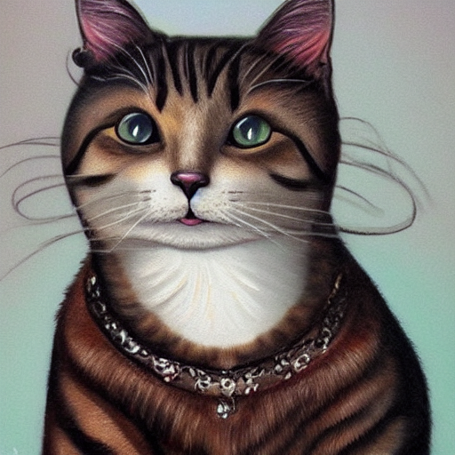
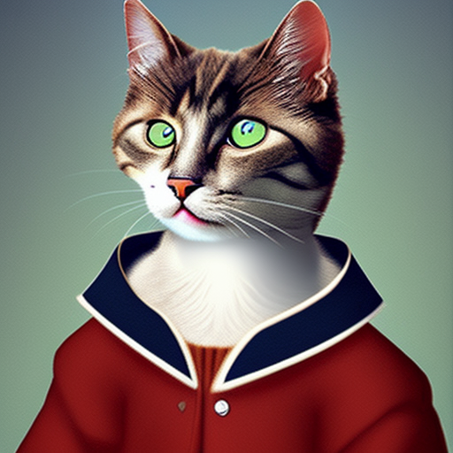

# Stable Diffusion in pytorch

A single file of Stable Diffusion. It is simple, easy reader.I hope you enjoyed. I hope you can discovery light!!!

The weights were ported from the original implementation.

# web demo at huggingface

https://huggingface.co/spaces/xfh/min-stable-diffusion-web

## Usage

### Download weights .pt file and clone project

#### weights file

1. sd-v1-4.ckpt(4GB) https://drive.google.com/file/d/13XKPH-RdQ-vCvaJJgVR7W6q9R5XbaTLM/view?usp=share_link
2. v1-5-pruned.ckpt(4GB, not include ema weights) https://drive.google.com/file/d/1IwBQ0DWfSNA50ymBvY0eby7v9RSIdSWu/view?usp=share_link
3. mdjrny-v4.ckpt(4GB, some weights cast float16 to float32) https://drive.google.com/file/d/1-Z5bE9GBpuupuyhoXWFZiEtldBzVJ61X/view?usp=share_link
4. waifu-diffusion-v1-4 weight
5. animev3.pt
6. Anything-V3.0.pt
7. 4,5,6 and other down address is https://huggingface.co/xfh/min-stable-diffusion-pt/tree/main

#### clone project

```bash
git clone https://github.com/scale100xu/min-stable-diffusion.git
```

#### Using pip install

Install dependencies using the `requirements.txt` file:

```bash
pip install -r requirements.txt
```

### help

```bash
python stable_diffusion.py --help
```

```
usage: stable_diffusion.py [-h] [--steps STEPS] [--phrase PHRASE] [--unphrase UNPHRASE] [--out OUT] [--scale SCALE] [--model_file MODEL_FILE]
                           [--img_width IMG_WIDTH] [--img_height IMG_HEIGHT] [--seed SEED] [--device_type DEVICE_TYPE] [--input_image INPUT_IMAGE]

Run Stable Diffusion

options:
  -h, --help            show this help message and exit
  --steps STEPS         Number of steps in diffusion (default: 50)
  --phrase PHRASE       Phrase to render (default: anthropomorphic cat portrait art )
  --unphrase UNPHRASE   unconditional Phrase to render (default: )
  --out OUT             Output filename (default: /tmp/rendered.png)
  --scale SCALE         unconditional guidance scale (default: 7.5)
  --model_file MODEL_FILE
                        model weight file (default: ../min-stable-diffusion-pt/mdjrny-v4.pt)
  --img_width IMG_WIDTH
                        output image width (default: 512)
  --img_height IMG_HEIGHT
                        output image height (default: 512)
  --seed SEED           random seed (default: 443)
  --device_type DEVICE_TYPE
                        device type, support: cpu;cuda;mps (default: cpu)
  --input_image INPUT_IMAGE
                        input image file (default: )
```
### Using `stable_diffusion.py` from the git repo

Assuming you have installed the required packages, 
you can generate images from a text prompt using:

```bash
python stable_diffusion.py --model_file="/tmp/stable_diffusion_v1_4.pt" --phrase="An astronaut riding a horse" --device_type="cuda"
```

The generated image will be named `/tmp/render.png` on the root of the repo.
If you want to use a different name, use the `--out` flag.

```bash
python stable_diffusion.py --model_file="/tmp/stable_diffusion_v1_4.pt"  --phrase="An astronaut riding a horse" --out="/tmp/image.png" --device_type="cuda"
```

## Example outputs 

The following outputs have been generated using this implementation:

1) anthropomorphic cat portrait art



2) anthropomorphic cat portrait art(mdjrny-v4.pt)



3) Kung Fu Panda(weight: wd-1-3-penultimate-ucg-cont.pt, steps:50)


## References

1) https://github.com/CompVis/stable-diffusion
2) https://github.com/geohot/tinygrad/blob/master/examples/stable_diffusion.py